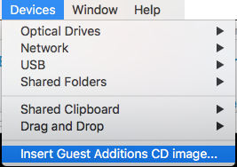
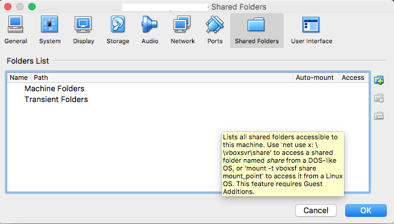
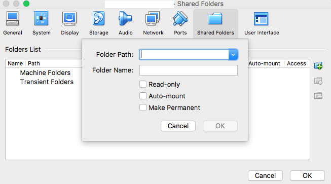
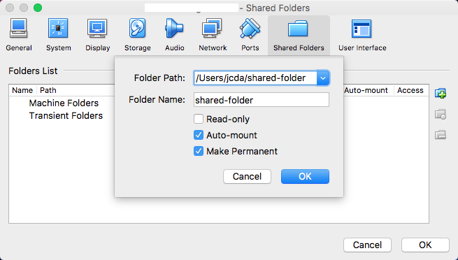
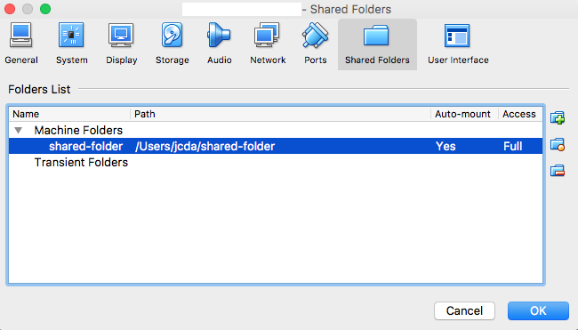

### Goals of this document
The main goal of this document is to provide a step by step of components to add to an installation of CentOS or Fedora from the minimal ISO image, so that Virtualbox features are enabled:

- Have a direct access to the virtual host via ssh or test http services from the management machine.

- Have a shared directory between the two.

### Pre Requisites

. Oracle Virtualbox installed on your OS
. An installation ISO for CentOS

### Steps

#### . Creation of a new image
#### . Add a new interface for "Host Only adapter"
#### . Installation of the CentOS basic 
#### . Network configuration

``` ip address``` will give you a status of network interfaces. In this configuration, you should have 3, one of them being the loopback interface `lo`. 
From there, you can select the name of the interface connected to the NAT. Now you can invoke
``` dhclient <NETWORK_INTERFACE>```
to make it permanent, edit **/etc/sysconfig/network-scripts/ifcfg-<NETWORK_INTERFACE>** and put the value of **ONBOOT=yes**
do the same with the second detected interface so you can access it via ssh.

#### . Entering of the CentOS session as root and typing the following commands:

``` yum -y install epel-release && yum -y update && yum -y upgrade ``` this will install the latest updates and upgrades, and add access to the EPEL repository. Following this invoke, some other installs will be necessary, but for the moment we will have the latest packages versions for what is already installed, and access to the third party packages.

#### . Reboot 

This is to use the latest kernel, as the Virtualbox scripts will query the kernel version from the currently used one.


|***From now you can  access your host from your manager via ssh***|
---
#### . Install the development packages

``` yum install gcc make kernel-devel ```


#### . Mount the Utils virtual CD from Virtualbox

after you selected the ***Devices->Insert Guest Addition CD in the virtual*** window menu



open a terminal as **root** and type the following command:

``` mount /dev/sr0 /media ```
#### . Compile

still as root launch the following command:

```cd /media && ./VBoxLinuxAdditions.run```

This will compile the kernel modules and (optionally, if you installed the GUI environment with the development packages for it ... ) the X modules that enables resizing on the fly.
 

#### . Create and add a shared directory between your host and your guest

in the bottom right corner, you can see the icon for the shared directory.

when starting a new Virtual Guest, it should be "ghosted"


When you clic on it, a contextual menu should appear


Put your pointer on this and clic on it



Clic on the "add folder" icon on the right

A new window appears with the settings of the shared directory.



Put the valuesof the directory you want to share.
by default, I'd recommend Auto-mount and Make permanent options.



And press **OK**

The next window will be now on the front



And press **OK** again

After the next reboot, this will be taken in account.


#### . Access to this Directory

from now on, the root user will be able to access the shared folder through the path **/mnt/sf_shared-folder/

**Enjoy !**